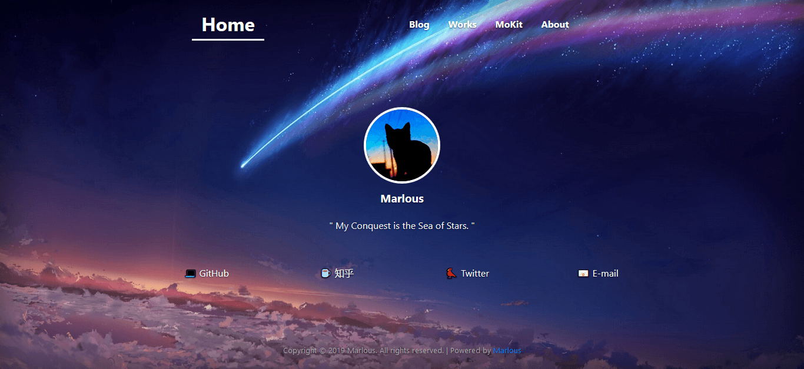
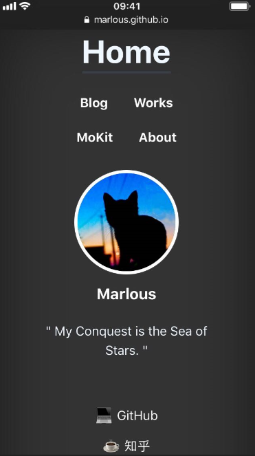

# PWCat-Personal（Profile Website - Personal Editon）
## Introduction - 介绍
### Summary - 概要  
个人主页网站。

### Features - 特性
1. 个人主页网站组成：
- 主要由三个板块构成：home、works、about。
- 想要增加自己需要的页面，只需要修改代码中导航栏中的链接和增加页面即可。
- 网站的背景放在 `img` 文件夹中，命名为 `cool-background.png`，以及其他资源也放在此文件夹中。

2. 效果截图：
- Desktop 截图：  

- Mobile 截图：  

## Development - 开发
1. 项目结构概述：
- 主页放在 src 文件夹的根目录
- 其他页面放在对应的文件夹中
- 其中 mokit 为一个单独添加的项目（所以它的 CSS 等文件放在自己的文件夹中）

2. CSS 文件结构：
- main.css 为整个网站主要的结构样式（如导航栏、页脚等）
- common.css 为一些通用的样式
- 各自页面独有的样式 CSS 文件

## Support - 支持
### Contact - 联系
- E-mail：Goonecat@foxmail.com

## License - 版权信息
PWCat-Personal is released under the GPL license. See [LICENSE](https://github.com/Marlous/PWCat-Personal/blob/master/LICENSE) for additional details.